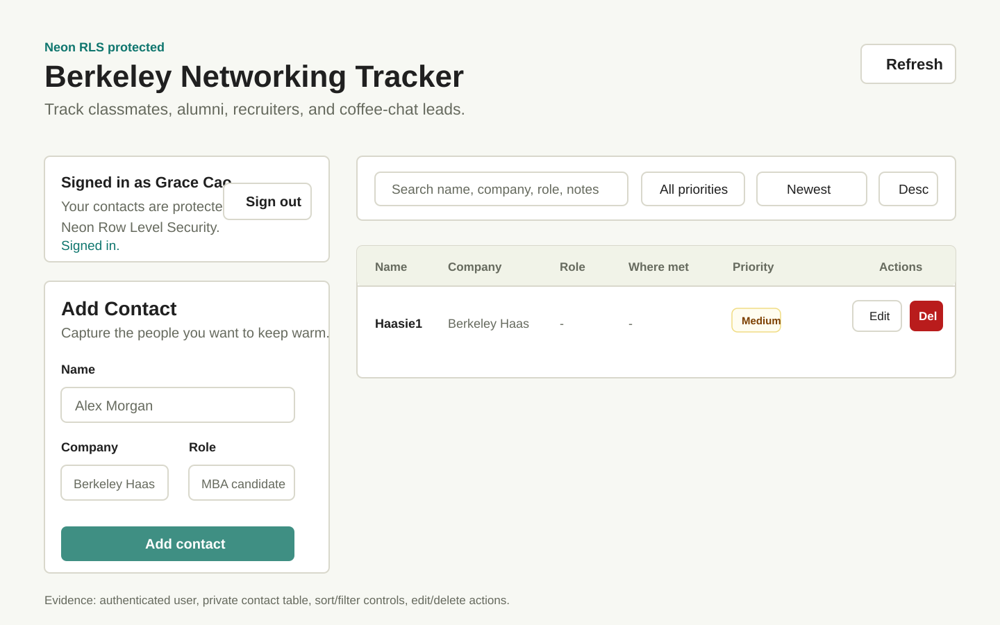
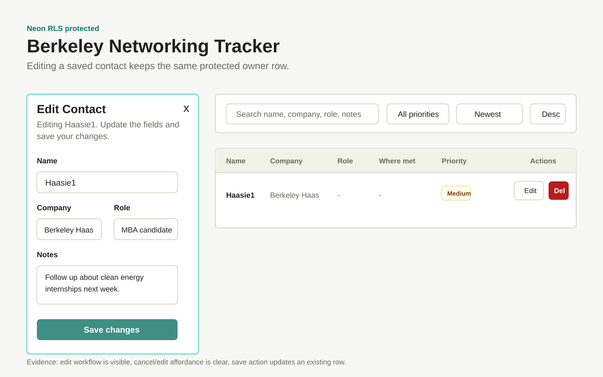
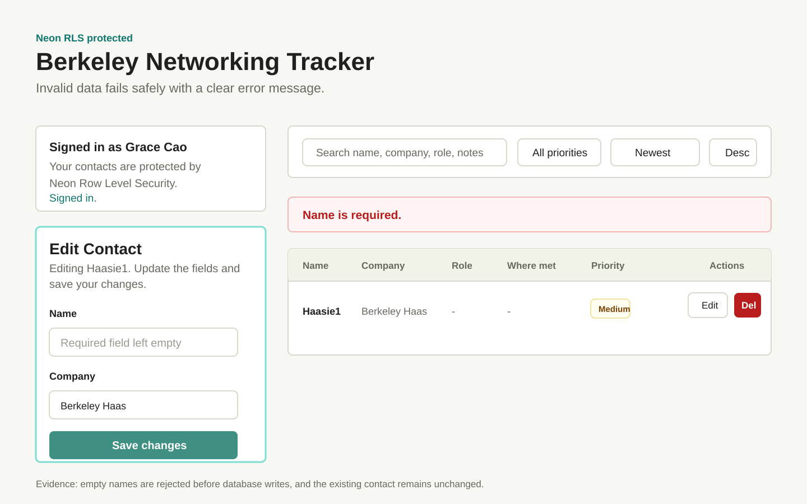
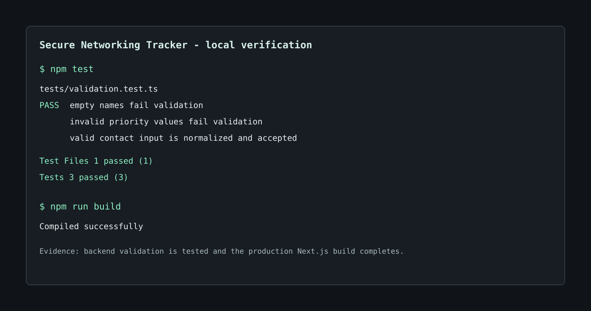
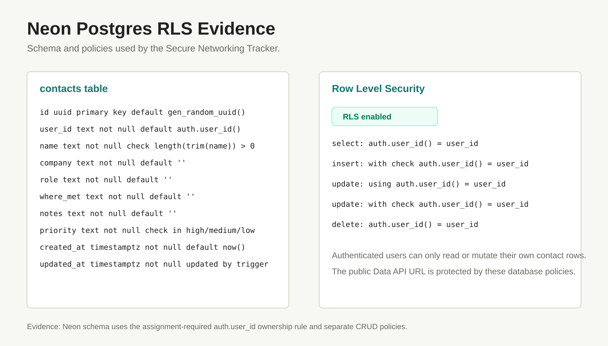

# Secure Networking Tracker

Secure Networking Tracker is a small full-stack web app for tracking Berkeley networking contacts. Authenticated users can sign in, manage a private contact list, and rely on Neon Postgres Row Level Security so each account can access only its own rows.

## Live App

[Open the live app](https://secure-networking-tracker-teal.vercel.app)

## Product Walkthrough

The walkthrough images below document the local verification states used for grading evidence.

### Signed-In Contact List



### Edit Contact Workflow



### Invalid Input Fails Safely



### Automated Test Output



### Neon Schema And RLS



## Features

- Neon Managed Better Auth sign-up, sign-in, and sign-out
- Private contact list for each authenticated user
- Create, view, edit, delete, sort, and filter contacts
- Contact fields: name, company, role, where met, notes, and priority
- Priority is limited to `high`, `medium`, or `low`
- Loading, empty, success, and error states
- Responsive web and mobile layout
- Server-side validation endpoint plus database constraints
- Automated validation tests

## Technology Stack

- **Next.js and React:** App Router UI and backend route handlers in one deployable Vercel app.
- **TypeScript:** Safer form, contact, and database types.
- **Tailwind CSS with local component primitives:** A consistent design system without heavy setup.
- **Neon Managed Better Auth:** User registration, sessions, sign-in, and sign-out.
- **Neon Data API with `@neondatabase/neon-js`:** Browser-safe authenticated CRUD calls protected by RLS.
- **Neon Postgres:** Durable relational storage.
- **Vitest:** Fast automated tests for validation rules.
- **Vercel:** Public hosting and production environment variables.

## Architecture

The frontend is a Next.js client interface in `src/components`. It renders the auth panel, contact form, toolbar, and contact list.

The backend logic is separated into a Next.js validation route at `src/app/api/contacts/validate/route.ts` and shared validation code in `src/lib/validation.ts`. The app validates contact input before writes, and the database enforces the same critical rules with `NOT NULL` and `CHECK` constraints.

Authentication and database access are handled through the Neon JavaScript SDK in `src/lib/neon-client.ts`. The client uses the assignment-required two-URL object form:

```ts
createClient({
  auth: { url: NEXT_PUBLIC_NEON_AUTH_URL },
  dataApi: { url: NEXT_PUBLIC_NEON_DATA_API_URL },
})
```

The public Data API URL is safe to expose only because the `contacts` table has Row Level Security enabled and every CRUD policy checks `auth.user_id() = user_id`.

## Local Setup

1. Clone the repository.
2. Install dependencies:

```bash
npm install
```

3. Copy the environment template:

```bash
cp .env.example .env.local
```

4. Create a Neon project, enable Managed Better Auth, enable the Data API, and fill in `.env.local`.
5. Run the SQL in `db/schema.sql` from the Neon SQL editor.
6. Start the app:

```bash
npm run dev
```

7. Open `http://localhost:3000`.

## Environment Variables

Commit `.env.example` only. Keep `.env.local` and all real values out of Git.

| Name | Scope | Notes |
| --- | --- | --- |
| `NEXT_PUBLIC_NEON_AUTH_URL` | Browser-safe | HTTPS Neon Auth endpoint |
| `NEXT_PUBLIC_NEON_DATA_API_URL` | Browser-safe | HTTPS Neon Data API `/rest/v1` endpoint |
| `DATABASE_URL` | Server-only | Postgres connection string, never expose |
| `NEON_AUTH_BASE_URL` | Server-only | Auth service base URL if server auth helpers are added |
| `NEON_AUTH_COOKIE_SECRET` | Server-only | Cookie secret if server auth helpers are added |

## Database Schema

The SQL setup enables `pgcrypto` for UUID generation and `pg_session_jwt` for the `auth.user_id()` helper used by Neon Auth/Data API RLS policies.

The `contacts` table:

| Column | Type | Rule |
| --- | --- | --- |
| `id` | `uuid` | Primary key, defaults to `gen_random_uuid()` |
| `user_id` | `text` | Not null, defaults to `auth.user_id()` |
| `name` | `text` | Not null, trimmed value cannot be empty |
| `company` | `text` | Not null, defaults to empty string |
| `role` | `text` | Not null, defaults to empty string |
| `where_met` | `text` | Not null, defaults to empty string |
| `notes` | `text` | Not null, defaults to empty string |
| `priority` | `text` | Not null, must be `high`, `medium`, or `low` |
| `created_at` | `timestamptz` | Not null, defaults to `now()` |
| `updated_at` | `timestamptz` | Not null, updated by trigger |

## Authentication And RLS

Neon Managed Better Auth issues the authenticated session. The Neon Data API validates the session token and makes the current user available to Postgres as `auth.user_id()`.

Row Level Security is enabled on `contacts`. Separate `SELECT`, `INSERT`, `UPDATE`, and `DELETE` policies all restrict rows to:

```sql
auth.user_id() = user_id
```

The insert and update policies use `WITH CHECK`, so a user cannot create or edit a row that belongs to someone else.

## Testing

Run automated tests:

```bash
npm test
```

Current automated coverage verifies:

- Empty names fail validation.
- Invalid priority values fail validation.
- Valid contact input is normalized and accepted.

Latest local result:

```text
Test Files  1 passed (1)
Tests       3 passed (3)
```

Latest local production build result:

```text
npm run build
Compiled successfully
```

## Two-Account Privacy Test

Before submitting, verify locally and in production:

1. Sign in as User A and create a contact.
2. Sign out.
3. Sign in as User B.
4. Confirm User B cannot see User A's contact.
5. Attempt to access or modify User A's row directly through the app or Data API and confirm RLS blocks it.

### Production UI verification — September 9, 2026 (UTC)

Tested on the live Vercel app using two different authenticated accounts:

1. User A created a synthetic contact named `Privacy Test A 20260909`, with company `Synthetic test data`.
2. After a full browser reload, User A searched for that name and the saved contact was still displayed.
3. User A signed out; the app returned to the sign-in screen and hid the contact list.
4. User B signed in. The same search returned **No contacts found**, with no Edit or Delete action for User A's contact.

**Result:** UI-level account isolation and refresh persistence passed.

Actual production browser screenshots were captured as `privacy-test-a-20260909.jpg` and `privacy-test-b-20260909.jpg`. Upload to `docs/screenshots/` is pending. The synthetic contact was retained for follow-up verification.

**Coverage limit:** Direct authenticated Data API attempts to read, update, or delete User A's row as User B have not yet been performed. These UI results do not establish database-level cross-account mutation protection.

## Deployment

1. Push the repository to GitHub.
2. Import the repository into Vercel.
3. Add production environment variables in Vercel.
4. Add the deployed Vercel domain to Neon Auth trusted origins.
5. Open the live URL in a private browser window.
6. Create two accounts and repeat the privacy test.
7. Add the live URL, screenshots, and test output to this README.

## Known Limitations

- The app intentionally focuses on the required single-user private contact tracker workflow.
- There is no admin dashboard, contact sharing, team workspace, or AI feature.
- Future improvements could add contact reminders, CSV export, richer tags, and end-to-end browser tests.
